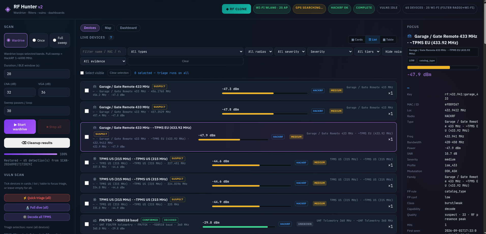
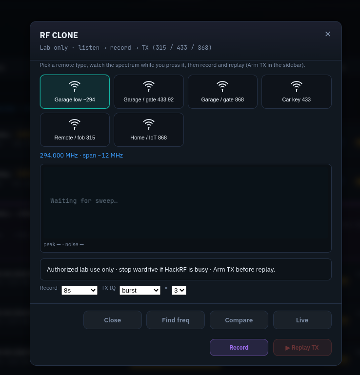
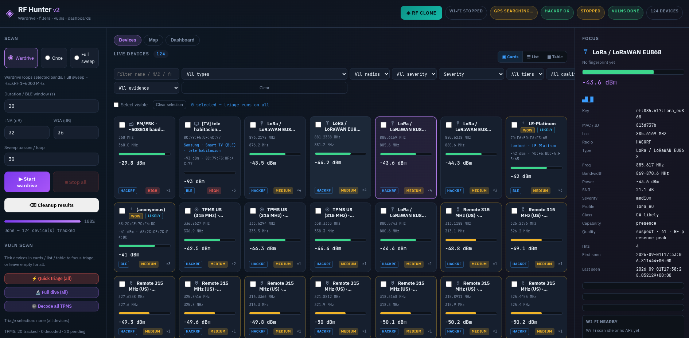
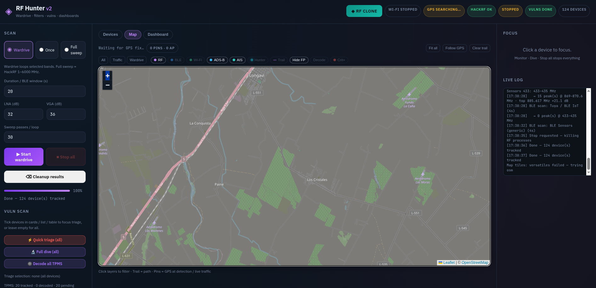
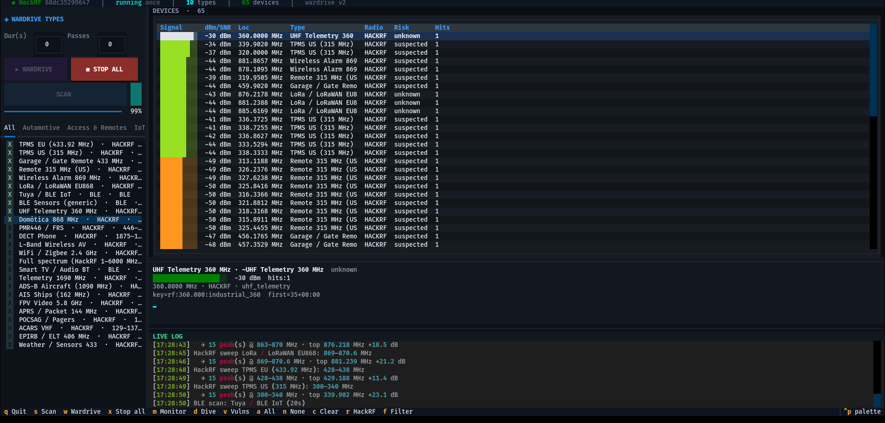

# RF Hunter

**RF security research platform for authorized lab use** — wardrive-style scanning with HackRF, BLE, GPS-backed map, optional Wi‑Fi correlation, live monitoring, protocol decode, and RF replay workflows.

Dual interface: **web dashboard** (FastAPI + static frontend) and **terminal UI** (Textual). Built for field labs, capture triage, and structured device tracking — not for unauthorized spectrum use.

> Use only on networks, devices, and frequency bands you own or have explicit written permission to test.

---

## Screenshots

| Web UI — wardrive map & live tracker | Web UI — device focus & decode |
|:---:|:---:|
|  |  |

| Web UI — scan & triage | Web UI — RF clone / replay lab |
|:---:|:---:|
|  |  |

| Terminal UI (TUI) |
|:---:|
|  |

---

## What it detects

Device types are driven by [`backend/data/device_catalog.yaml`](backend/data/device_catalog.yaml). The scanner sweeps catalog bands, upserts hits into a live tracker, and runs decode / fingerprint pipelines where supported.

| Category | Device types | Typical bands | Capability |
|----------|--------------|---------------|------------|
| **Automotive** | TPMS EU (433.92 MHz), TPMS US (315 MHz) | 315 / 433 MHz | Decode sensor IDs, pressure, temperature |
| **Access & remotes** | Garage / gate 433 MHz, US 315 MHz remotes, wireless alarms 869 MHz | 315 / 433 / 869 MHz | Presence, rtl_433-class decode, RF replay lab |
| **IoT & smart home** | LoRa / LoRaWAN EU868, domótica 868 MHz, Tuya BLE, generic BLE sensors, weather stations 433 MHz, Wi‑Fi / Zigbee 2.4 GHz | 433 / 868 / 2.4 GHz + BLE | Decode (433/868), BLE GATT map, presence |
| **Industrial / telemetry** | UHF telemetry ~360 MHz, telemetry 1690 MHz, POCSAG pagers, full spectrum survey | 169–470 / 360 / 1690 MHz / 1–6000 MHz | Decode (POCSAG, rtl_433), spectrum presence |
| **Comms & AV** | PMR446 / FRS, DECT phones, L‑band wireless AV, Smart TV / audio BLE, APRS 144 MHz | 144 / 446 / 1.2 GHz / 1.8 GHz + BLE | Presence, BLE identity, LAN remote hints |
| **Aviation** | ADS‑B 1090 MHz, ACARS VHF, FPV video 5.8 GHz | 131 / 1090 / 5.8 GHz | ADS‑B decode + map pins, FPV frame detect |
| **Maritime** | AIS ships 162 MHz, EPIRB / ELT 406 MHz | 162 / 406 MHz | AIS presence, distress beacon presence |

**Capability legend**

- **Decode** — structured frames or identifiers (TPMS, ADS‑B, rtl_433, POCSAG, BLE GATT, etc.)
- **BLE** — Bluetooth advertisement + optional GATT / manufacturer data
- **Presence** — energy / burst detection and band classification without full protocol parse

Fingerprinting uses OUI, BLE company IDs, and YAML rules to refine vendor and device class beyond raw spectrum hits.

---

## Features

- **Wardrive mode** — continuous catalog-driven sweeps; devices upsert with signal history and GPS pins when available
- **HackRF integration** — `hackrf_sweep` / `hackrf_transfer`; exclusive radio gate for scan vs monitor vs replay
- **BLE discovery** — advertisements, company ID / OUI rules, deep GATT dive on selected targets
- **Wi‑Fi correlation** — parallel AP scan on a second NIC, map overlay, device correlation
- **Live monitor** — focused RSSI / narrow RF sampling on one tracker entry
- **Risk triage** — severity labels and structured findings from catalog profiles + dive output
- **RF clone lab** — listen → IQ capture → optional PWM decode → gated TX replay (lab allowlist bands)
- **Research pipeline** — offline capture manifests, clustering, quality scoring (`scripts/research/`; outputs gitignored)

---

## Requirements

### Hardware

- **[HackRF One](https://greatscottgadgets.com/hackrf/)** (or compatible) with **firmware up to date** — check with `hackrf_info`; flash the latest release from the [HackRF docs](https://hackrf.readthedocs.io/en/latest/updating_firmware.html) if needed. Install the host tools: `hackrf_sweep`, `hackrf_transfer`.
- **GPS receiver** (USB or serial, u-blox / NMEA) running through **`gpsd`** — **required for the wardrive map** (hunter trail, live position, device geolocation pins). Without a GPS fix the map stays on a neutral world view and pins cannot be placed on your route.
- Optional: second Wi‑Fi NIC (`wlan1` by default) for AP scan and correlation.

### Software

- Linux (Debian / Kali-style systems tested)
- Python **3.11+**
- **Decode / companion stack** — install as many modules as your targets need: `rtl_433`, `multimon-ng`, BlueZ/BLE, `iw` (Wi‑Fi scan). More modules = broader catalog coverage (TPMS, POCSAG, ADS‑B helpers, BLE GATT, etc.).
- Docker optional — privileged, USB passthrough, host network (see `docker-compose.yml`)

---

## Quick start

### Clone and virtualenv

```bash
git clone https://github.com/zpol/rf-hunter.git
cd rf-hunter
python3 -m venv .venv
source .venv/bin/activate
pip install -r requirements.txt
```

### Captures directory

Sweep data, IQ captures, and tracker state are written under `captures/` (gitignored):

```bash
mkdir -p captures
export RF_HUNTER_CAPTURES="$(pwd)/captures"
```

### Terminal UI

```bash
./rf-hunter-v2
```

| Key | Action |
|-----|--------|
| `w` | Start wardrive |
| `s` | One-shot scan |
| `x` | Stop scan / monitor |
| `Enter` | Focus row |
| `m` | Monitor focused device |
| `d` | Deep dive + risk |
| `c` | Clear tracker |
| `r` | Refresh HackRF status |
| `q` | Quit |

### Web UI

```bash
export RF_HUNTER_CAPTURES="${RF_HUNTER_CAPTURES:-$(pwd)/captures}"
python -m uvicorn backend.app.main:app --host 0.0.0.0 --port 8081
```

Open **http://localhost:8081**

The wardrive map uses **VersaTiles / OpenStreetMap** raster tiles (no API key). It needs a **GPS fix via `gpsd`** to center on your position, draw the hunter trail, and pin devices to your route — start `gpsd` against your receiver before wardriving. Basemap falls back automatically if a tile provider blocks requests.

### Docker

```bash
mkdir -p captures
docker compose up --build
```

Service listens on **8081** with `network_mode: host`, USB bind-mount, and D‑Bus for HackRF + BLE.

---

## Configuration

| Variable | Default | Purpose |
|----------|---------|---------|
| `RF_HUNTER_CAPTURES` | `./captures` | Sweeps, IQ, tracker JSON, replay CAPs |
| `RF_HUNTER_CATALOG` | `backend/data/device_catalog.yaml` | Device type catalog |
| `HACKRF_SERIAL` | *(empty)* | Lock to one HackRF when several are connected |
| `RF_HUNTER_WIFI_IFACE` | `wlan1` | Interface for parallel Wi‑Fi scan |
| `GPSD_HOST` / `GPSD_PORT` | `127.0.0.1` / `2947` | GPS fix via `gpsd` — required for map trail and device pins |

See also [`AGENTS.md`](AGENTS.md) for architecture notes and lab gotchas.

---

## API (selection)

| Method | Path | Role |
|--------|------|------|
| `GET` | `/api/health` | HackRF, GPS, Wi‑Fi, scan status |
| `POST` | `/api/scan/start` | `{ "mode": "wardrive" \| "once", ... }` |
| `GET` | `/api/tracker` | Live device snapshot |
| `POST` | `/api/monitor/start` | Focused live samples |
| `POST` | `/api/replay/listen` | IQ capture + decode (RF clone lab) |
| `WS` | `/ws/scan` | `device_update`, `tracker_snapshot`, … |

---

## Tests

```bash
python -m pytest tests/ -v
```

Most unit and TUI tests run without HackRF hardware.

---

## Project layout

```
backend/app/     FastAPI, scanner, tracker, BLE, Wi‑Fi, decode, risk, replay
backend/data/    Device catalog, fingerprint DB (OUI, rules)
frontend/        Static web UI
tui/             Textual terminal UI
doc/             Screenshots for README / docs
scripts/         Deploy helpers, research triage (offline)
tests/
captures/        Local evidence (not in git)
```

---

## License

Apache-2.0 — see [LICENSE](LICENSE).

## Disclaimer

This software is for **security research and education** in controlled environments. Transmitting or intercepting RF without authorization may violate local law. You are responsible for compliance with spectrum regulations and permission requirements.
